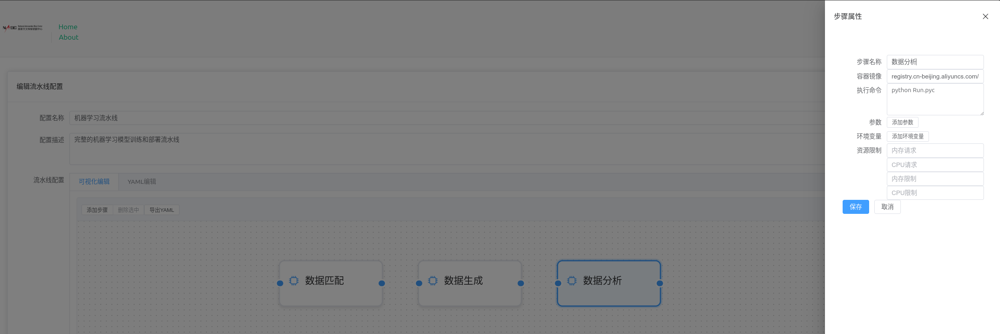
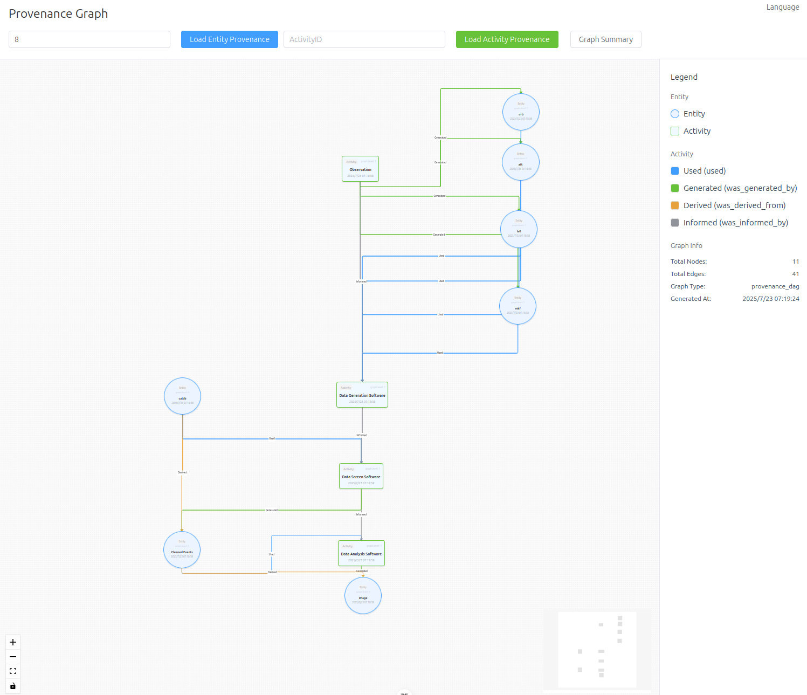

# NADC Workflow - Astronomical Data Processing Pipeline Management System

## Project Introduction

The Astronomical Data Processing Pipeline Management System provides pipeline configuration, instance management, and node monitoring functionalities.

## Model Architecture

From large to small: Project - Workflow Template - Workflow Instance - Workflow Node

## Chinese-English Glossary (Variable Names):

| Chinese    | English          | Notes                                           |
| ---------- | ---------------- | ----------------------------------------------- |
| 项目       | Project          | Project name                                    |
| 流水线配置 | WorkflowTemplate | A project contains a set of workflow templates  |
| 流水线实例 | Workflow         | Instance created based on a workflow template   |
| 流水线节点 | Activity         | Multiple execution steps in a workflow instance |

## Tech Stack

- Frontend: Vue3 + TypeScript + Element Plus + VueFlow
- Backend: Flask + SQLAlchemy
- Backend Execution: Argo Workflow + Rabbit MQ

## Key Features

### Workflow Configuration Management

Drag-and-drop visual configuration, with support for direct YAML text editing and configuration file format checking, combining ease of use and flexibility.

In addition to standard DAGs (Directed Acyclic Graphs), it also supports `Cyclic` and `Unknown Next Actions` modes. [What are these two modes? In which scenarios are they used?](https://journalofcloudcomputing.springeropen.com/articles/10.1186/s13677-021-00229-7)

(Diagram source: Krämer, M., Würz, H. M., & Altenhofen, C. (2021). Executing cyclic scientific workflows in the cloud. Journal of Cloud Computing, 10(1), 25. https://doi.org/10.1186/s13677-021-00229-7)

### Data Provenance

Follow the IVOA Provenance Model, support for data provenance graph display and search.

