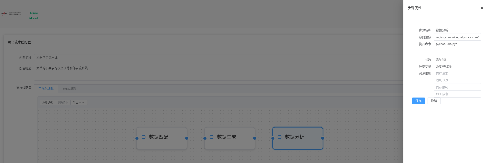
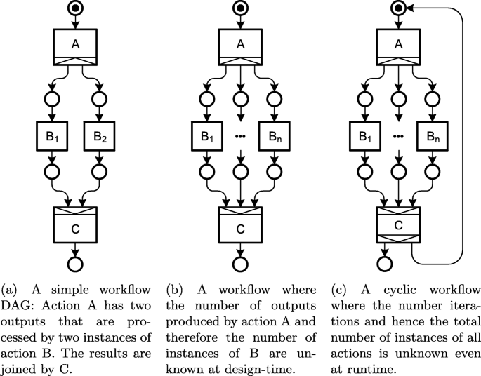

# NADC Workflow - 天文数据处理流水线管理系统

## 项目介绍

天文数据处理流水线管理系统，提供流水线配置、实例管理和节点监控功能。

## 模型架构

从大到小： 项目 - 流水线配置 - 流水线实例 - 流水线节点

## 中英文对照表（变量名）：

| 中文       | 英文             | 备注                             |
| ---------- | ---------------- | -------------------------------- |
| 项目       | Project          | 项目名称                         |
| 流水线配置 | WorkflowTemplate | 一个项目包含一组流水线配置       |
| 流水线实例 | Workflow         | 依据流水线配置创建的实例         |
| 流水线节点 | Action           | 一个流水线实例包含的多个执行步骤 |

## 技术栈

- 前端： Vue3 + TypeScript + Element Plus + VueFlow
- 后端： Flask + SQLAlchemy
- 后台执行： Argo Workflow + Rabbit MQ

## 特色功能

### 流水线配置管理

拖拽式的可视化配置，同时支持直接对 YAML 的文本编辑和配置文件格式检查，兼具易用性和灵活性。

除了普通的 DAG（有向无环图）外，还支持`Cyclic`和`Unknown Next Actions`两种模式。[这两种模式是什么？有哪些场景？](https://journalofcloudcomputing.springeropen.com/articles/10.1186/s13677-021-00229-7)

（示意图来源：Krämer, M., Würz, H. M., & Altenhofen, C. (2021). Executing cyclic scientific workflows in the cloud. Journal of Cloud Computing, 10(1), 25. https://doi.org/10.1186/s13677-021-00229-7）

### 数据溯源

遵循 IVOA 溯源模型，支持数据溯源图的显示和搜索。

